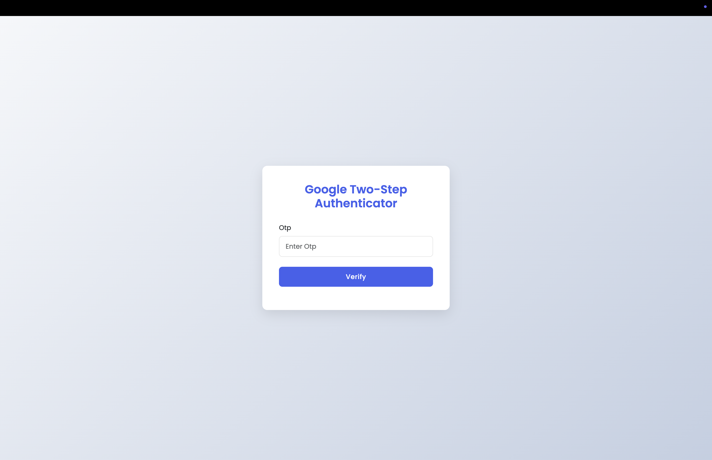
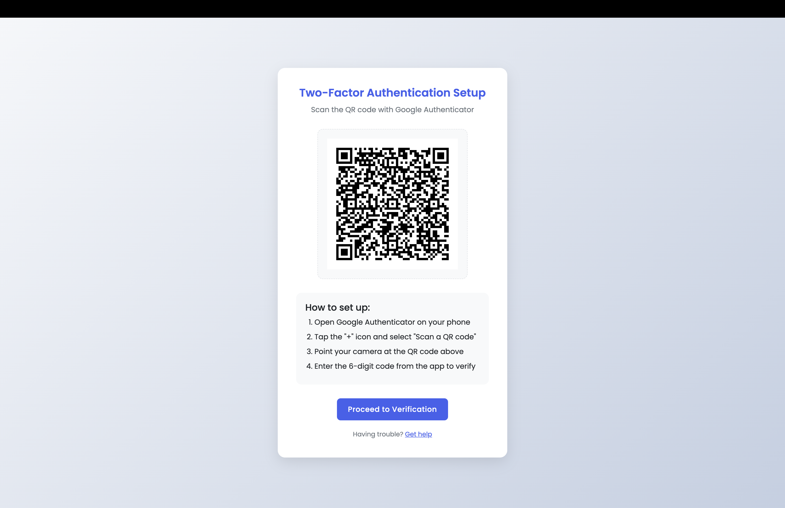
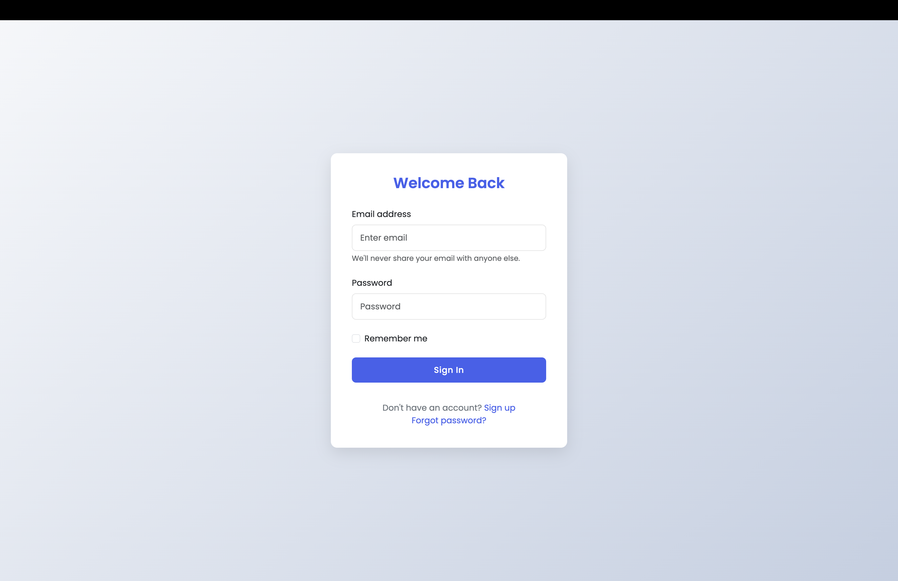

# ASP.NET Core MVC - Google Authenticator Integration 🔐

This repository contains a simple implementation of **Google Authenticator-based two-factor authentication (2FA)** using **ASP.NET Core MVC**. The project demonstrates how to generate and verify Time-based One-Time Passwords (TOTP) for secure user login.

## 📸 Screenshots

| Login Page | OTP Generation | OTP Verification |
|------------|----------------|------------------|
|  |  |  |

## 📽️ Demo Video

**▶️ [Watch on YouTube](https://youtu.be/DvQBzD0tqRk?si=K983x7FYNRQcbCv_)**

This video provides a step-by-step walkthrough of integrating **Google Authenticator** into an **ASP.NET Core MVC** application using the `Otp.NET` and `QRCoder` libraries. It covers:

- Setting up and configuring the required NuGet packages  
- Generating QR codes to scan with the Google Authenticator app  
- Creating and validating Time-based One-Time Passwords (TOTP)  
- Securing user logins with Two-Factor Authentication (2FA)

Ideal for developers looking to add an extra layer of security to their ASP.NET Core projects using a clean and minimal implementation.

## 🛠️ Features

- User login with Google Authenticator-based OTP verification
- QR code generation for Google Authenticator setup
- TOTP generation and validation using `OATH` standard
- Secure and simple 2FA mechanism

## 🚀 Getting Started

### Prerequisites

- [.NET 8 SDK](https://dotnet.microsoft.com/download/dotnet/8.0)
- Visual Studio Code or any C#-compatible IDE
- Google Authenticator app (iOS/Android)

### Clone the repository

```bash
git clone https://github.com/aamirindi/Google-Authenticator.git
cd Google-Authenticator
dotnet watch run


